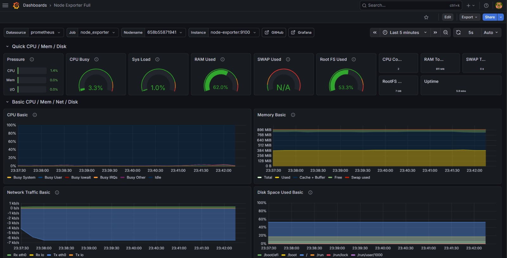

# AWS Monitoring | Prometheus & Grafana

This project is a fully automated cloud monitoring solution built with Terraform and Docker. It provisions an AWS EC2 instance and deploys a complete monitoring stack (Prometheus, Grafana, and Node Exporter) to track system health in real-time.

This is the infrastructure and monitoring configuration. For the dashboard visualization, a screenshot is provided below.



## How to run ?

You don't need to manually install Prometheus or Grafana. The entire stack runs inside Docker containers on a cloud instance managed by Terraform.

### **1. Prerequisites**
#### **A. Install Terraform**
- Download the appropriate package for your OS from the [official Terraform website](https://developer.hashicorp.com/terraform/install).
- Extract the executable and add it to your system's PATH.
- Verify installation: `terraform -version`

#### **B. Configure AWS CLI**
- Install the AWS CLI by following the [official AWS guide](https://docs.aws.amazon.com/cli/latest/userguide/getting-started-install.html).
- **How to get AWS Credentials:**
1. Log in to your [AWS Management Console](https://aws.amazon.com/console/).
2. Search for IAM in the search bar and click on it.
3. In the left sidebar, click on **Users** and select your user (or create a new one with `AdministratorAccess`).
4. Go to the Security credentials tab.
5. Scroll down to the Access keys section and click Create access key
6. Select Command Line Interface (CLI as the use case, check the confirmation box, and click Next
7. **IMPORTANT** Copy your Access Key ID and Secret Access Key Download the `.csv` file, as this is the only time you will see the secret key.
8. Run the configuration command (in terminal):
```
aws configure
```
9. For default output format, type 'json'.

#### **C. Generate SSH Key Pair**
- Go to the AWS Console -> EC2 -> Network & Security -> Key Pairs
- Create a new key pair named `prometheus-key`.
- Download the `.pem` file and keep it in a secure location.

### **2. Clone the repository to your local machine**

```
git clone https://github.com/iustinflorian/prometheus_metrics.git
cd prometheus_metrics
```

```
prometheus_metrics/
├── prometheus/
│   └── prometheus.yml       # Prometheus configuration and scrape targets
├── .gitignore               # Excludes sensitive files (tfstate, keys, etc.)
├── docker-compose.yml       # Orchestrates the monitoring stack containers
├── grafana-preview.jpg      # Dashboard screenshot for visual documentation
└── main.tf                  # Terraform code for AWS infrastructure                  
```

### **3. Provision the infrastructure:**
- Initialize Terraform and create the AWS resources:

```
terraform init
terraform apply -auto-approve
```
### **4. Running the application:**
- Connect to the EC2 instance and launch the monitoring stack with a single command:

```
sudo docker-compose up -d
```
### **5. Accessing the dashboards:**
- **Grafana:** http://**your-ec2-ip**:3000 (Login: admin / admin)
- **Prometheus:** http://**your-ec2-ip**:9090

## **Tech Stack**
- Cloud: AWS (EC2, Security Groups)
- Infrastructure as Code (IaC): Terraform
- Containerization: Docker & Docker Compose
- Monitoring: Prometheus & Node Exporter
- Visualization: Grafana

## **License**
This project is licensed under the MIT License - see the [LICENSE](LICENSE) file for details.
